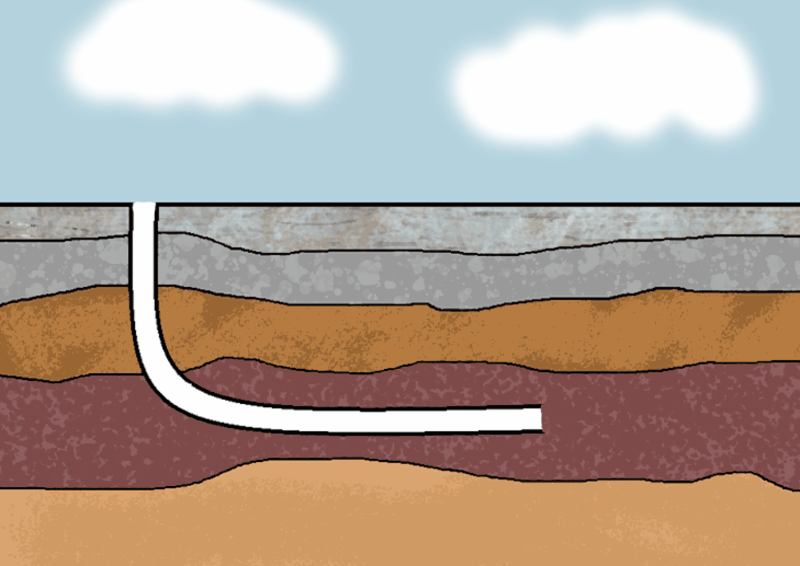
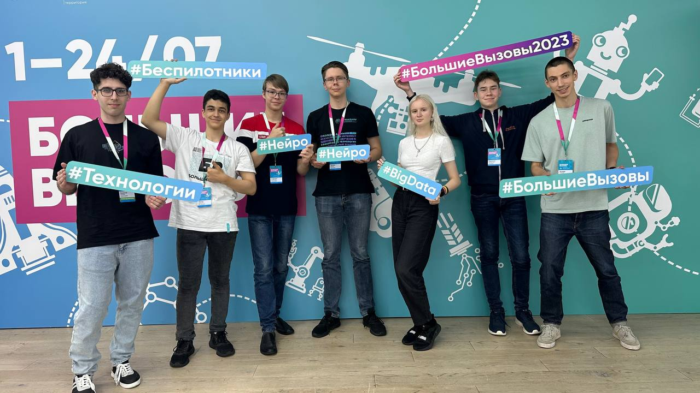

# seismo-helper

## Автоматический анализ сейсмической активности геологических сред
Наш партнёр: [Газпромнефть](https://www.gazprom-neft.ru/)

Наша цель:
Создание сервиса для автоматического мониторинга сейсмической активности

#Основные задачи
* 1 Предобработать данные и задетектировать события
  + Используем полосовой фильтр и находим STA/LTA
* 2 Нейросеть-пикировщик
  + Обучили свёрточную нейронную сеть для определения точного времени прихода P- и S-волн
* 3 Определение координат гипоцентра
  + С помощью математического алгоритма определяем координаты гипоцентра сейсмического возмущения
* 4 Web-сервис
  + Написали backend и frontend с RestAPI, создали дизайн

